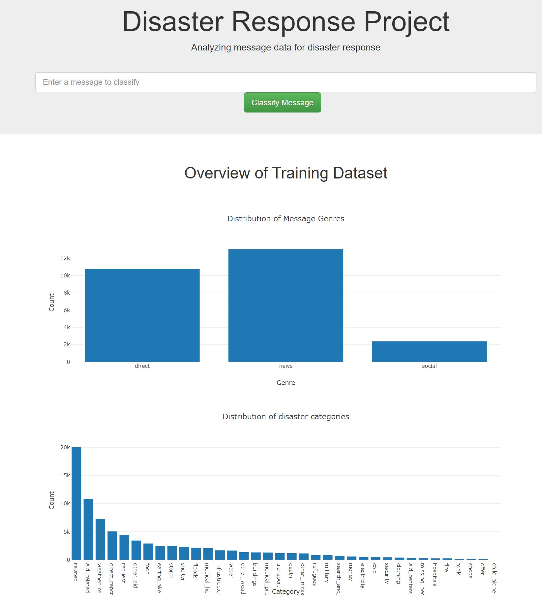
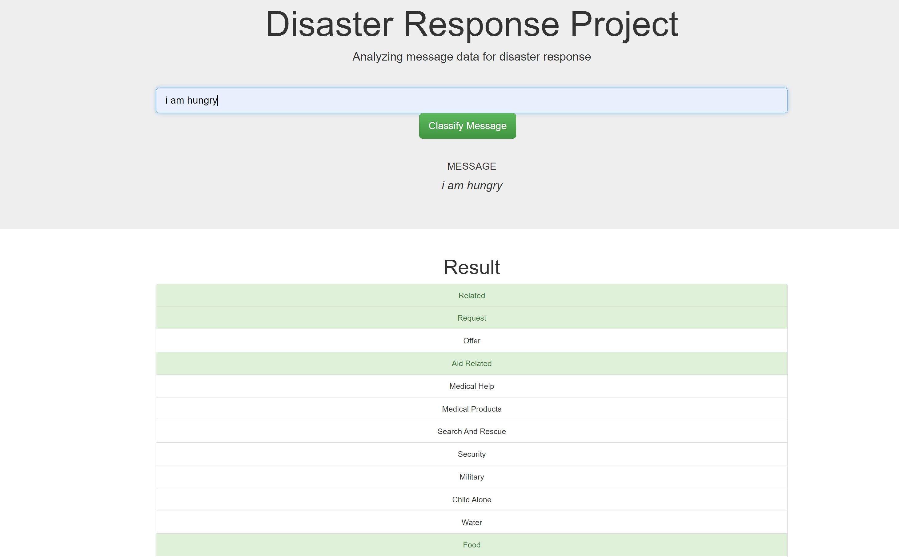
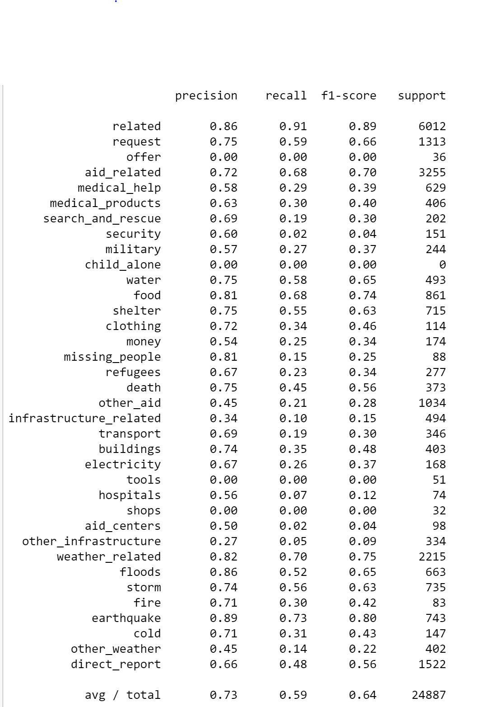

# Disaster-response-ML-pipeline
Disaster response ML pipeline is a natural language process machine learning pipeline that consists of text processing, feature extraction, modeling and Flask web app display. This ML 
pipeline categorizes communication messages, either direct or through news or social media following a disaster, into 36 categories. The purpose of this Ml pipeline is to help disaster
response organizations filter and pull out the most important and relevant message effciently when a disaster happens. 

## Files
### Raw datasets
* ./data/disaster_categories.csv\
 This file contains response categories
* ./data/disaster_messages.csv\
 This file conatins raw mesages

### ETL pipeline
 ./data/process_data.py contains ETL pipeline. 
* Loads the messages and categories datasets
* Merges the two datasets
* Cleans the data
* Create a SQLite database with an SQLAlchemy engine
* Stores it in a SQLite database
 
### ML pipeline
./models/train_classifier.py creates a machine learning pipeline that uses NLTK, as well as scikit-learn's Pipeline and GridSearchCV to output a final model that uses 
the message to predict classifications for 36 categories (multi-output classification). 
* Loads data from the SQLite database
* Splits the dataset into training and test sets
* Builds a text processing and machine learning pipeline
* Trains and tunes a model using GridSearchCV
* Outputs results on the test set
* Exports the final model as a pickle file

### Deploy Web app
./app/run.py uploads dataset and model to web app. This web app displays dataset visualizations and uses trained model to input text and return classification results.\

\

## Model limitations
Disaster response dataset is an imbalanced multioutput classification dataset. Some classes have very few observations, for instance child_alone, shops, offer, tools, fire, while other classes like foods, earthquake,storm have many observations. This severly skewed class distritions will bias the model towards the majority class, resulting in a low precision, recall and f1 scores for the minority class (image below). Another factor that might affect the model's preformance is train and test split. The commone method for classification train and test split is using a straitified split. In our case, the iterativeStratification in skmultilearn.model_selection will help solve the problem, but due to run time constraint, a simple train_test_split is used. This random split may assign all the observations of a minority class to the test set, which cause the model to have never seen an observation from this class during the training.

## How to run and depoy to local server
### Instructions:
1. Run the following commands to set up database and model.

    - To run ETL pipeline that cleans data and stores in database
        `python data/process_data.py data/disaster_messages.csv data/disaster_categories.csv data/DisasterResponse.db`
    - To run ML pipeline that trains classifier and saves
        `python models/train_classifier.py data/DisasterResponse.db models/classifier.pkl`

2. Run the following command in the app's directory to run web app.
    `python run.py`

3. Go to http://0.0.0.0:3001/

## Web app on cloud server Heroku
https://disaster-response-ml-pipeline.herokuapp.com/

## Source
The disaster response data source is owned by [Figure eight](https://appen.com/)

## Acknowledgement
Kudos to Figure Eight for providing this dataset and Udacity for guiding through this machine learning pipeline project

